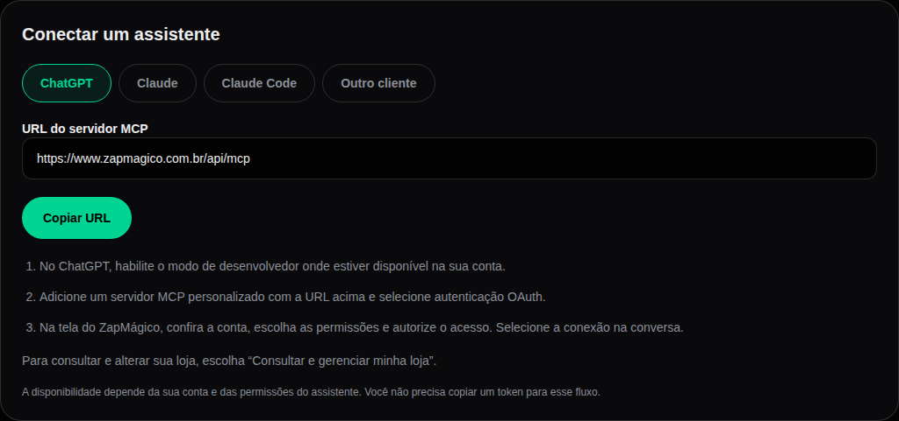
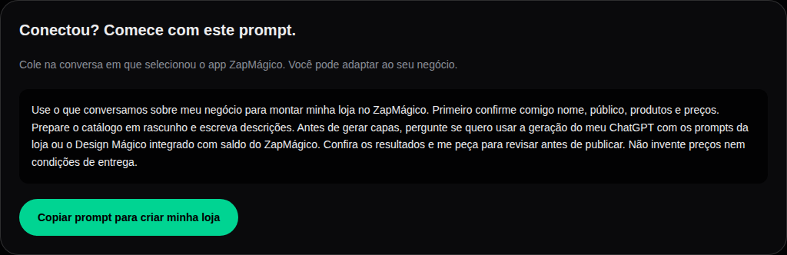
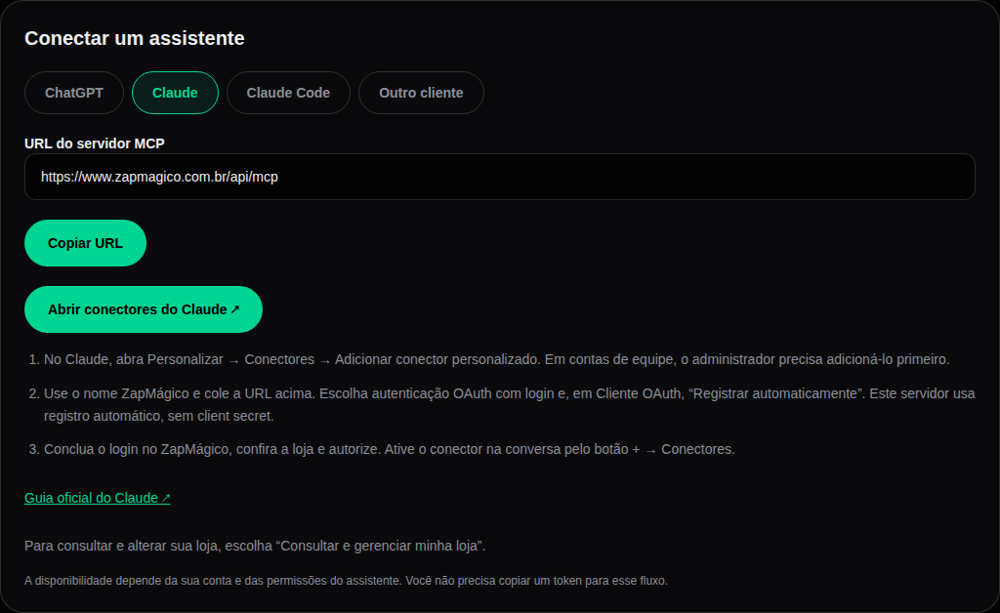
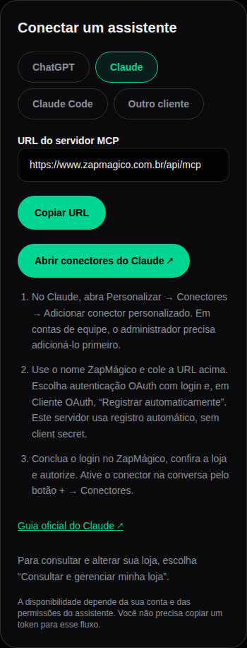
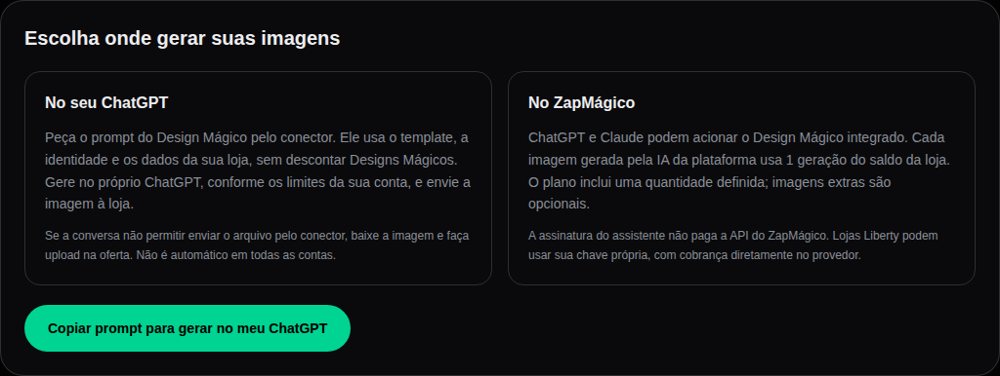
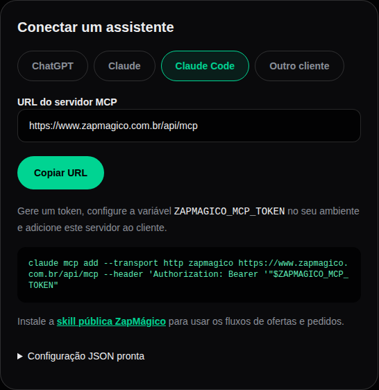
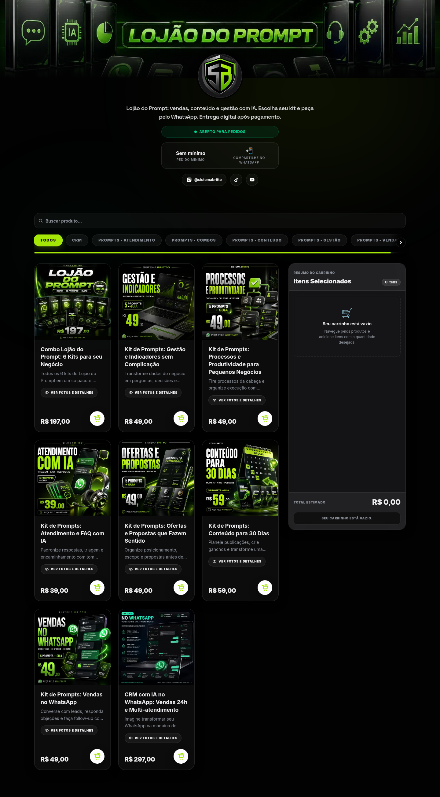

# ZapMágico · Sua loja no ChatGPT e Claude

Transforme a conversa sobre seu negócio em um catálogo: prepare produtos, descrições e imagens com a identidade da sua loja, revise e publique. Depois, consulte pedidos e atualize a vitrine pelo mesmo assistente.

[Configurar minha conexão](https://www.zapmagico.com.br/magic/mcp) · [Conhecer o ZapMágico](https://www.zapmagico.com.br/#mcp) · [Ver a skill](skills/zapmagico/SKILL.md) · [Documentação MCP](https://www.zapmagico.com.br/mcp.md)


**MCP de loja incluído nos planos pagos ativos e nas lojas Liberty.** O plano grátis e as recargas de imagens não liberam a conexão. Você cria sua conta/loja no ZapMágico e autoriza o assistente a trabalhar nela.

Este repositório distribui a **skill pública, documentação e exemplos de configuração**. O servidor remoto roda no ZapMágico; você não precisa hospedar um MCP. O código privado da plataforma não faz parte deste repositório.

## Escolha seu assistente

| Cliente | Como conectar | Precisa copiar token? |
| --- | --- | --- |
| ChatGPT | URL do MCP + OAuth + autorização da loja | Não |
| Claude web / Desktop | Conector remoto + OAuth + **Registrar automaticamente** | Não |
| Claude Code | MCP HTTP com variável de ambiente + skill opcional | Sim, neste exemplo |
| Outro cliente MCP | Streamable HTTP com Bearer, ou OAuth quando compatível | Depende do cliente |

**URL para todos os clientes:**

```text
https://www.zapmagico.com.br/api/mcp
```

O assistente usa o contexto da conversa em que você seleciona a conexão. Conectar não permite ler automaticamente todo o histórico da sua conta ChatGPT ou Claude.

## ChatGPT: conecte uma vez, crie por conversa

1. Abra [o setup da sua loja](https://www.zapmagico.com.br/magic/mcp) e escolha **ChatGPT**.
2. No ChatGPT, habilite o modo de desenvolvedor onde estiver disponível e adicione um servidor MCP personalizado com a URL acima.
3. Escolha **OAuth**, entre no ZapMágico e confira a loja. Para criar e alterar ofertas, autorize **Consultar e gerenciar minha loja**.
4. Selecione o app na conversa e comece consultando a loja. A disponibilidade e as permissões dependem da sua conta e organização no ChatGPT.



Teste inicial, sem alterações:

> Consulte minha loja e liste os produtos, sem alterar nada.

Depois, peça para montar seu catálogo:

> Use o que conversamos sobre meu negócio para montar minha loja no ZapMágico. Confirme nome, público, produtos, preços e entrega. Prepare o catálogo em rascunho. Antes de gerar capas, pergunte se quero usar a geração do meu ChatGPT com os prompts da loja ou o Design Mágico integrado com saldo do ZapMágico. Deixe tudo para eu revisar antes de publicar.



## Claude: OAuth sem token na conversa

1. Abra [o setup](https://www.zapmagico.com.br/magic/mcp) e escolha **Claude**.
2. No Claude, vá a **Personalizar → Conectores → Adicionar conector personalizado**. Use o nome `ZapMágico` e a URL do MCP. Em Team/Enterprise, o administrador precisa disponibilizar o conector primeiro.
3. Escolha login OAuth e, em **Cliente OAuth**, selecione **Registrar automaticamente**. O servidor atual suporta DCR; **a identidade publicada do Claude não é suportada**. Não informe client secret.
4. Entre no ZapMágico, confira a loja e autorize a permissão desejada.
5. Ative o conector na conversa pelo botão **+ → Conectores**. Peça: “Consulte minha loja e liste os produtos, sem alterar nada”.



O Claude pode consultar e gerenciar a loja e acionar o Design Mágico integrado. Isso não significa que sua assinatura Claude pague a API de imagens do ZapMágico, nem que todos os clientes ofereçam geração nativa de imagens.

[Guia oficial de conectores Claude](https://support.claude.com/en/articles/11175166-get-started-with-custom-connectors-using-remote-mcp).

<details>
<summary>Ver o setup Claude no celular</summary>



</details>

## Imagens: templates da loja, escolha de onde gerar

| Caminho | Como funciona | Quem paga a geração |
| --- | --- | --- |
| No próprio ChatGPT | `product_image_prompt` prepara o template, cores, dados da oferta e referência. Você usa a geração nativa quando disponível. | Conta do cliente, conforme os limites do ChatGPT. Preparar o prompt não desconta saldo ZapMágico. |
| Design Mágico integrado | `product_create_image` gera, salva na galeria e tenta colocar como capa. | IA da plataforma: 1 geração do saldo da loja por imagem. |
| Liberty com chave própria | Motor compatível configurado na loja, quando selecionado. | Provedor da chave própria; sem desconto do saldo da plataforma. |



**Gerar no ChatGPT não garante transferência automática da imagem.** O MCP recebe arquivos por `media_upload`, com bytes base64 reais e limites de tamanho. Se o cliente não conseguir passar o arquivo ao conector, baixe a imagem e faça upload na oferta. Não invente base64 nem links internos para contornar essa limitação.

Pedido para usar seu ChatGPT:

> Consulte `product_image_prompt` para a oferta escolhida e use o template da minha loja para gerar no próprio ChatGPT. Não chame `product_create_image` nem consuma Designs Mágicos sem minha autorização. Se não conseguir enviar a imagem pelo MCP, me oriente a baixar e fazer upload na oferta.

No Design Mágico integrado, `referenceMode: "none"` ajuda a criar uma direção nova sem herdar uma capa anterior; `"auto"` aproveita a imagem existente. `setAsCover: true` é o padrão. Se a imagem foi salva mas a capa não foi atualizada, reordene a galeria em vez de gerar outra.

As gerações integradas têm saldo finito. Limites de fotos/produtos continuam valendo nos dois caminhos. OAuth não transfere uma assinatura ChatGPT/Claude para a API de outro serviço.

## Claude Code + skill

A conexão fornece as ferramentas. A skill orienta o agente a preservar dados, usar os templates da loja, distinguir custos, revisar imagens e reconciliar timeouts. Ela não substitui autenticação nem aumenta suas permissões.



### 1. Configurar o MCP

No [setup](https://www.zapmagico.com.br/magic/mcp), escolha **Claude Code**, gere um token com consulta ou gestão e copie-o. O token completo aparece uma vez e tem validade de 90 dias.

Mescle a entrada de [examples/claude.mcp.json](examples/claude.mcp.json) no `.mcp.json` do seu projeto:

```json
{
  "mcpServers": {
    "zapmagico": {
      "type": "http",
      "url": "https://www.zapmagico.com.br/api/mcp",
      "headers": {
        "Authorization": "Bearer ${ZAPMAGICO_MCP_TOKEN}"
      }
    }
  }
}
```

Defina a variável no terminal antes de iniciar o Claude Code, sem gravar o token no JSON ou no histórico:

```bash
read -rsp 'Token MCP: ' ZAPMAGICO_MCP_TOKEN
printf '\n'
export ZAPMAGICO_MCP_TOKEN
claude
```

Abra `/mcp` para conferir. Não cole tokens na conversa nem publique credenciais no GitHub.

Alternativa pela CLI, que pode gravar o cabeçalho com o token no armazenamento local do cliente:

```bash
claude mcp add --transport http zapmagico \
  https://www.zapmagico.com.br/api/mcp \
  --header "Authorization: Bearer $ZAPMAGICO_MCP_TOKEN"
```

### 2. Instalar a skill completa

Copie **a pasta inteira**, incluindo `references/`, para o seu projeto. Escolha um diretório de clone que ainda não exista e confira qualquer skill já instalada antes de substituir arquivos:

```bash
git clone https://github.com/sistemabritto/zapmagico-mcp.git
mkdir -p .claude/skills
cp -R zapmagico-mcp/skills/zapmagico .claude/skills/
```

Para instalação pessoal em todos os projetos, copie a pasta `zapmagico` para `~/.claude/skills/`. Invoque `/zapmagico` ou peça uma tarefa relacionada à loja. [Documentação oficial de skills](https://code.claude.com/docs/en/skills).

```text
skills/zapmagico/
├── SKILL.md
└── references/
    ├── catalogo.md
    ├── imagens.md
    └── recuperacao.md
```

### 3. Exemplos de tarefas

- “Liste meus pedidos recentes e os status, sem alterar nada.”
- “Crie um rascunho desta camiseta de R$59,90, com tamanhos P/M/G.”
- “Melhore a descrição preservando preço, slug, fotos e variações.”
- “Prepare o prompt de capa com o template e as cores da minha loja.”
- “Consulte meu saldo e gere uma capa com o Design Mágico integrado.”
- “Revise os rascunhos e publique as ofertas que eu aprovar.”

## Da conversa à vitrine

O objetivo é transformar os dados do seu negócio em ofertas reais, com capa, descrição, preço e link da loja. A criação por MCP respeita os mesmos limites e permissões do painel.



A vitrine acima é um exemplo público existente. O print não representa uma loja criada integralmente pelo novo fluxo de geração nativa do ChatGPT.

## Permissões e administração

| Permissão | Acesso |
| --- | --- |
| `read` | Consultas, incluindo preparo do prompt de imagem. Não permite upload ou alteração. |
| `write` | Gestão da própria loja, respeitando plano e limites. |
| `admin` | Token geral emitido pelo [painel administrativo MCP](https://www.zapmagico.com.br/admin/mcp); exige `tenantId` nas ferramentas de loja. |

Descubra lojas com `admin_stores_list`. Um token de lojista nunca ganha acesso administrativo por informar outro `tenantId`. Acesso administrativo não expõe SQL, chaves internas ou infraestrutura.

## Validação e limites conhecidos

Atualização de **07/10/2026 · MCP 1.2.1**:

- `price` aceita `59.90` ou `59,90`. Antes, o ponto decimal era lido como separador de milhar e `79.00` virava R$ 7.900,00. Ofertas criadas pelo MCP antes da correção merecem conferência de preço.
- Slugs gerados a partir de títulos longos não terminam mais em hífen, o que fazia a atualização seguinte ser recusada.
- `store_update` aceita `bannerUrl` para voltar a um banner que a loja já usou, sem consumir crédito. Só são aceitas URLs da pasta de banners da própria loja; links externos ou de outra loja são recusados.

Atualização de **07/10/2026 · MCP 1.2.0**:

| Verificação | Situação |
| --- | --- |
| SDK MCP oficial em produção | Inicialização, 12 ferramentas de consulta / 39 de gestão, isolamento entre lojas, rascunho CRUD, preservação do catálogo, reconexão, expiração e revogação verificados. |
| Prompt da imagem no cliente | Retorno do template preparado sem geração, com `zapmagicoCreditsCharged: 0`, verificado em produção. |
| Claude Code | Consultas reais `get_profile` e `products_list` validadas em sessão anterior. |
| ChatGPT | OAuth e chamada real `get_profile` confirmados. A listagem de catálogo dentro do ChatGPT ainda precisa da confirmação do usuário. |
| Claude web | Setup OAuth publicado; validação na conta real ainda pendente. |
| Imagem nativa → upload automático | Depende de acesso ao arquivo no cliente. Fluxo completo ainda não validado no ChatGPT. |

O número de ferramentas pode mudar conforme versão e escopo; `tools/list` é a fonte atual. Prints de setup são **prévias do componente vigente**, com lista vazia de conexões e sem sessão autenticada; não são prova de autorização real. Landing e vitrine foram capturadas nas páginas públicas.

- Streamable HTTP via POST, respostas JSON, negociação pelo SDK oficial MCP.
- OAuth com DCR, PKCE S256 e consentimento. Access token por até 24h; refresh rotativo, limitado à autorização de até 90 dias.
- Revogar a conexão no painel invalida os acessos OAuth vinculados. Plano vencido também bloqueia MCP de loja.
- Upload: até 2 MB por arquivo e 3 MB no total. O servidor não baixa URLs externas fornecidas pelo modelo.
- Timeout não prova que uma geração, publicação, convite ou checkout falhou. Consulte o recurso antes de repetir; `operation_outcome_unknown` não deve gerar retry automático.
- Checkout criado não é pagamento confirmado. Pedido recebido não é comprovação de venda paga.

## Documentação e ajuda

- [Skill e fluxos](skills/zapmagico/SKILL.md)
- [MCP: documentação publicada](https://www.zapmagico.com.br/mcp.md)
- [llms.txt para agentes](https://www.zapmagico.com.br/llms.txt)
- [Claude Code MCP](https://code.claude.com/docs/en/mcp)
- [Conectores Claude](https://support.claude.com/en/articles/11175166-get-started-with-custom-connectors-using-remote-mcp)
- [ChatGPT: modo de desenvolvedor e MCP](https://help.openai.com/en/articles/12584461-developer-mode-and-mcp-apps-in-chatgpt)

Licença MIT para skill, documentação e exemplos. O serviço ZapMágico segue seus próprios termos. ZapMágico é uma integração independente; não implica parceria ou certificação OpenAI/Anthropic.
