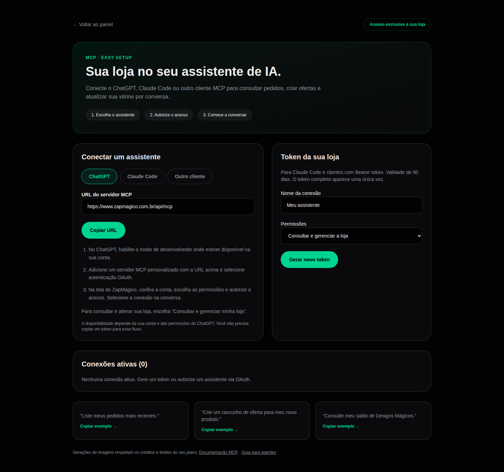

# ZapMágico MCP + skill para Claude Code

Conecte sua loja ZapMágico a um assistente de IA para consultar pedidos, gerenciar ofertas e configurar a vitrine por conversa.

Este repositório distribui a **skill pública e exemplos de configuração do conector remoto**. O servidor roda na aplicação ZapMágico; este repositório não instala um servidor local nem inclui o código privado da plataforma.

> Lançamento inicial: a implementação do servidor e painel foi criada na aplicação. O uso público depende da aplicação da migração MCP e do deploy. A publicação deste repositório não significa validação concluída dentro do ChatGPT ou Claude Code.



## Configuração no Claude Code

1. Abra [o painel MCP da sua loja](https://www.zapmagico.com.br/magic/mcp), gere um token e copie-o. Você pode escolher consulta ou gestão. O token aparece uma única vez e vence em 90 dias.
2. Use `examples/claude.mcp.json` como entrada no arquivo `.mcp.json` do seu projeto. Se já existir configuração, mescle a entrada `zapmagico`.
3. Defina o token no ambiente, sem gravá-lo no JSON nem no histórico do terminal:

```bash
read -rsp 'Token MCP: ' ZAPMAGICO_MCP_TOKEN
printf '\n'
export ZAPMAGICO_MCP_TOKEN
claude
```

No Claude Code, abra `/mcp` para verificar a conexão. O JSON usa expansão da variável de ambiente; a variável precisa estar disponível ao iniciar o Claude.

Alternativa pela CLI (grava o cabeçalho no armazenamento local do Claude Code):

```bash
claude mcp add --transport http zapmagico \
  https://www.zapmagico.com.br/api/mcp \
  --header "Authorization: Bearer $ZAPMAGICO_MCP_TOKEN"
```

Prefira o JSON com variável de ambiente quando compartilhar configurações. Não publique o token.

## Instalar a skill

Clone este repositório e copie a skill para seu projeto:

```bash
git clone https://github.com/sistemabritto/zapmagico-mcp.git
mkdir -p .claude/skills/zapmagico
cp zapmagico-mcp/skills/zapmagico/SKILL.md .claude/skills/zapmagico/SKILL.md
```

Para todos os seus projetos, use `~/.claude/skills/zapmagico/SKILL.md`. Reinicie o Claude Code e invoque `/zapmagico`, ou peça uma tarefa relacionada à sua loja.

A skill orienta o uso; o MCP fornece as ferramentas e faz as verificações de autorização. A skill não substitui o token.

## Exemplos

- “Liste meus pedidos recentes e os status.”
- “Crie um rascunho para uma camiseta de R$59,90 com tamanhos P, M e G.”
- “Melhore a descrição deste produto mantendo preço, imagens e variações.”
- “Consulte os créditos antes de gerar um Design Mágico.”

## ChatGPT

Adicione um servidor MCP personalizado com a URL `https://www.zapmagico.com.br/api/mcp`, usando OAuth. A conexão usa descoberta de metadados, registro dinâmico de cliente, PKCE S256, consentimento e renovação de tokens. Escolha as permissões na tela do ZapMágico.

O uso depende da disponibilidade de conexões personalizadas e permissões na sua conta ChatGPT. A disponibilidade do servidor e a validação dentro de cada cliente são etapas distintas.

## Administração

O [painel administrativo MCP](https://www.zapmagico.com.br/admin/mcp) permite gerar um token geral. Use `admin_stores_list` para descobrir IDs; passe `tenantId` em cada ferramenta de loja. Tokens de lojista têm escopo fixo e não recebem acesso administrativo.

## Protocolo e limites

- Streamable HTTP, POST, respostas JSON; protocolo negociado pelo SDK oficial MCP.
- Bearer token para clientes compatíveis; OAuth para conexão autenticada no ChatGPT.
- Permissões `read`, `write` e `admin`; tokens de acesso OAuth duram até 24h e têm refresh rotativo, limitado à autorização de 90 dias.
- Revogação pelo painel invalida também acessos OAuth vinculados.
- Limites de produtos, fotos, membros e créditos continuam válidos. Gerações podem demorar; não repita operações com efeitos sem consultar seu estado.
- Upload base64: até 2 MB por arquivo, 3 MB no total. O servidor não baixa URLs fornecidas pelo modelo.
- O token administrativo opera as lojas e as ferramentas publicadas; isso não equivale a expor SQL, segredos internos, webhooks ou acesso irrestrito à infraestrutura.

## Descoberta

- [Documentação MCP](https://www.zapmagico.com.br/mcp.md)
- [llms.txt](https://www.zapmagico.com.br/llms.txt)
- [Skill](skills/zapmagico/SKILL.md)
- [Exemplo de configuração](examples/claude.mcp.json)
- `tools/list` fornece o catálogo atual conforme as permissões do token.

## Referências oficiais

- [Claude Code MCP](https://code.claude.com/docs/en/mcp)
- [Claude Code skills](https://code.claude.com/docs/en/skills)
- [OpenAI: autenticação MCP](https://developers.openai.com/plugins/build/auth)

Licença MIT para a skill, documentação e exemplos deste repositório. O serviço ZapMágico segue seus próprios termos.
